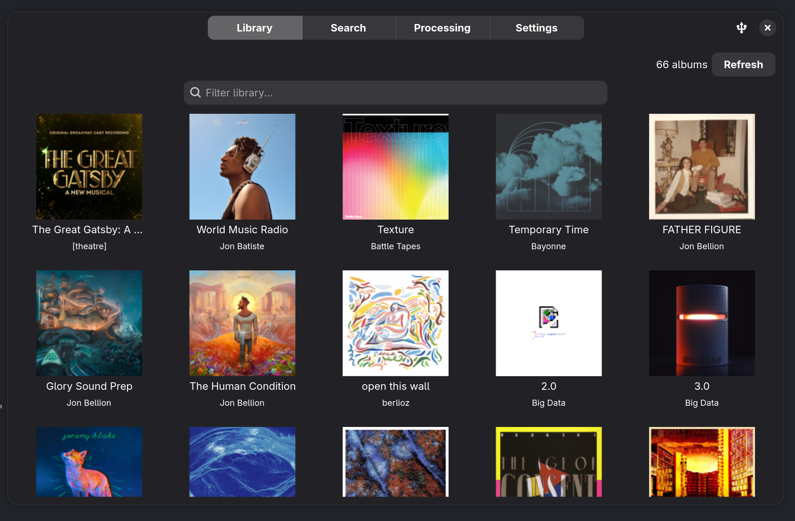

# Skimmer

<p align="center">
  
</p>



GTK4 music manager built for the Innioasis Y1 (though it works with any USB
media device/Rockbox device)

Built with Python, GTK4 + Adwaita, GStreamer, and MPRIS integration.

## What's it for?

Having a little MP3 player is fun, but managing music can be a pain. What if you
could just easily download any album and have it sync in seconds to your MP3
player? That's why I built this. It skims (hence the name) from yt-music and
then downloads them (and organizes with the `beet` utility). It is really for me
and my Innioasis Y1, but I thought I would share so anyone else using a Rockbox
device can easily get and sync music.

## Features

- Sync music library to Innioasis Y1
- MPRIS media controls (playerctl, D-Bus)
- YouTube Music integration (search, download)
- Album art display
- Queue-based playback

## Dependencies

- Python ≥ 3.11
- GTK4, Adwaita, GStreamer (provided by GNOME Platform runtime on Flatpak)
- [uv](https://docs.astral.sh/uv/) — project manager

## Build from source

### Linux (Flatpak)

```bash
flatpak-builder --user --install --force-clean build-dir build-aux/flatpak/tech.jptr.Skimmer.yml
flatpak run tech.jptr.Skimmer
```

### macOS (Homebrew)

PyGObject requires GLib available at runtime via `dlopen`. On ARM macOS, uv's
managed Python doesn't set the `LC_RPATH` needed to find Homebrew's libraries,
so use Homebrew's Python when creating the virtual environment.

```bash
brew install python@3.14 gtk4 libadwaita gstreamer gst-plugins-base \
  gst-plugins-good gobject-introspection pango graphene pygobject3 glib \
  meson ninja
uv venv --python /opt/homebrew/bin/python3.14
uv sync
uv run skimmer
```

### Generic

```bash
uv sync
uv run skimmer
```

## Updating dependencies

1. Edit `pyproject.toml`
2. `uv sync`
3. `bash build-aux/flatpak/update-deps.sh` (regenerates Flatpak dep bundle,
   neccesary because of python deps needing to be prefetched)

## Installation

Icons and desktop file are bundled in the Flatpak. For local desktop integration:

```bash
cp build-aux/data/icons/512x512/apps/tech.jptr.Skimmer.png ~/.local/share/icons/hicolor/512x512/apps/
cp build-aux/data/icons/256x256/apps/tech.jptr.Skimmer.png ~/.local/share/icons/hicolor/256x256/apps/
gtk4-update-icon-cache -f -t ~/.local/share/icons/hicolor/
```

## License

MIT
